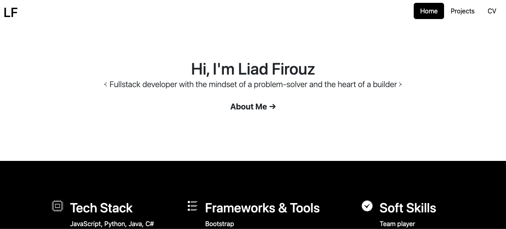
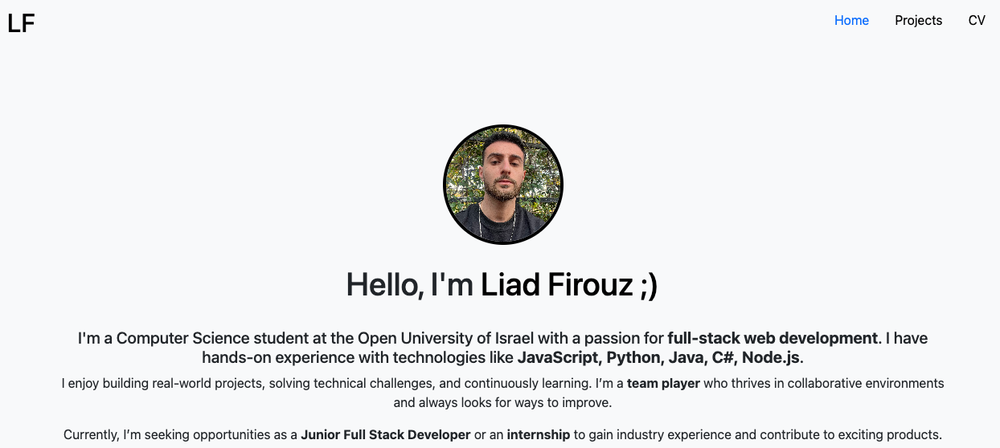

# Liad Firouz WEB Project

https://liadfirouz.github.io/Liad-Firouz-WEB-2.0/index.html
A clean and modern personal website built with HTML and CSS.  
This project serves as a professional portfolio or personal presentation site.

---

## 🔧 Technologies Used

- HTML5
- CSS3
- *(Coming soon)* JavaScript for interactive elements
- Frameworks
- Bootstrap
- VS code


## 🚀 Running Locally

1. Clone the repository:
   ```bash
   git clone https://github.com/LiadFirouz/Liad-Firouz-WEB-2.0.git

## SVGs:



## Text:

Hi I'm Liad Firouz
The best fullstack developer you will ever hire!

Familler with
Python
Java
HTML
And more ...

Frameworks
React
Bootstrap
VS code

Qualitys
responsible
self-educated
diligent

“Live as if you were to die tomorrow.
Learn as if you were to live forever”
.Mahatma Gandhi

Don't be a stranger
get in touch


